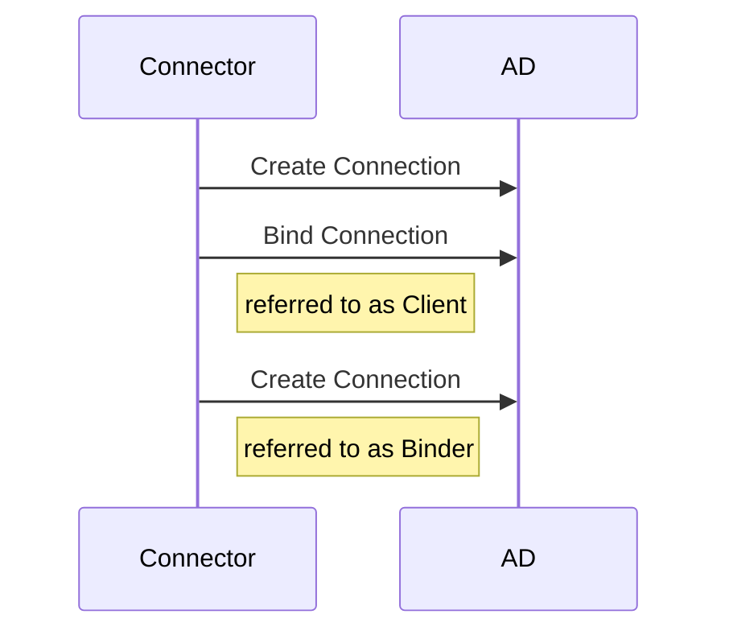
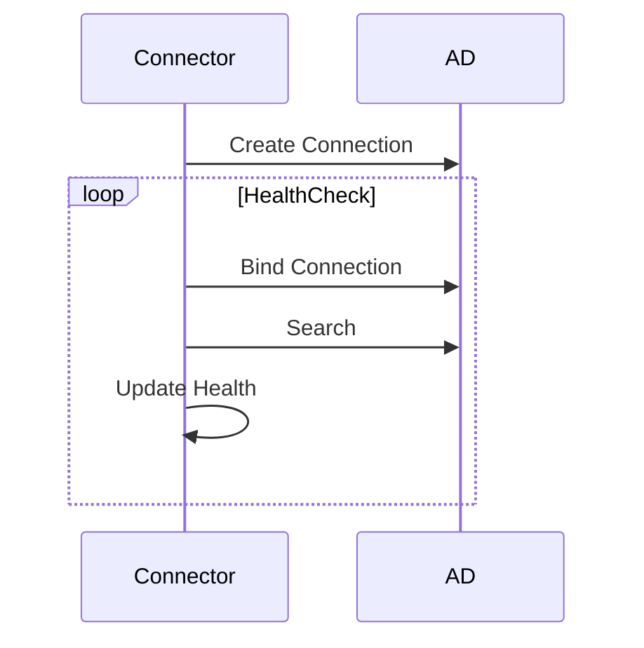
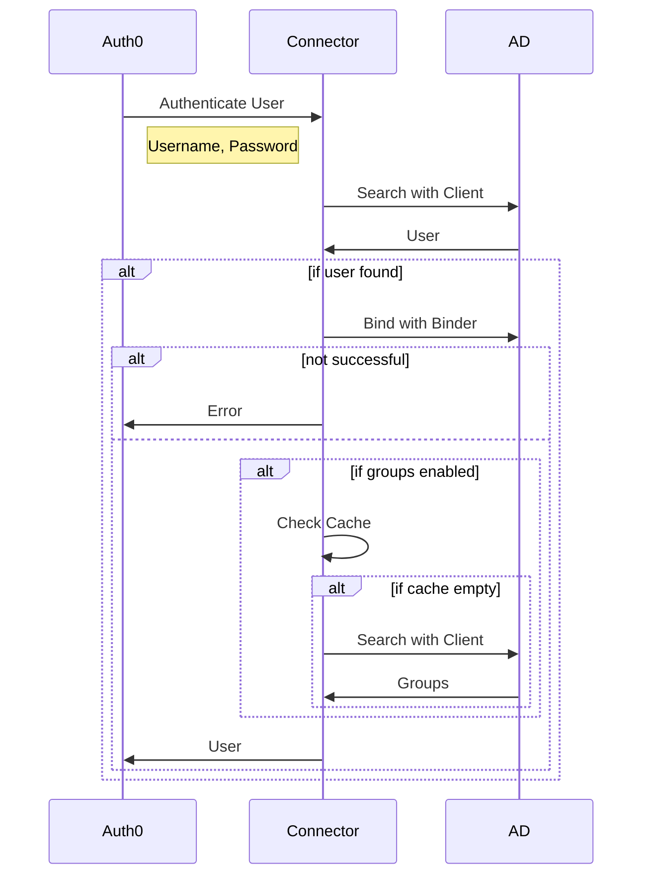
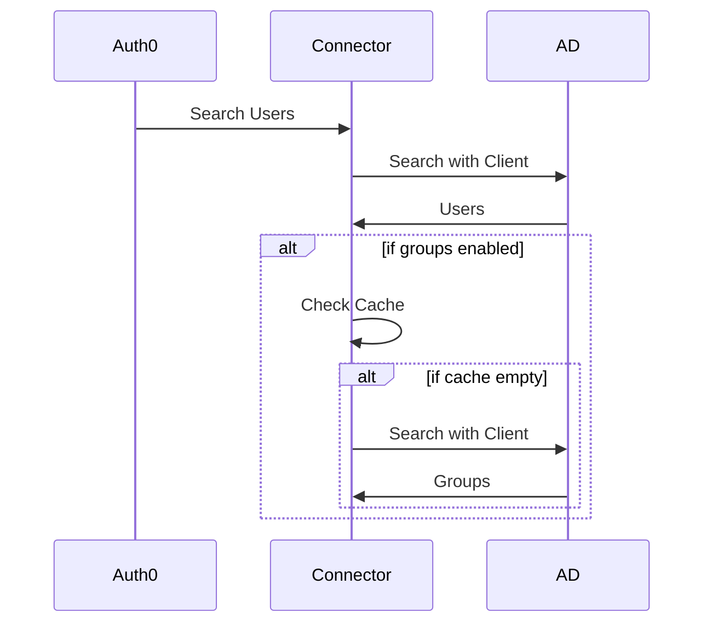
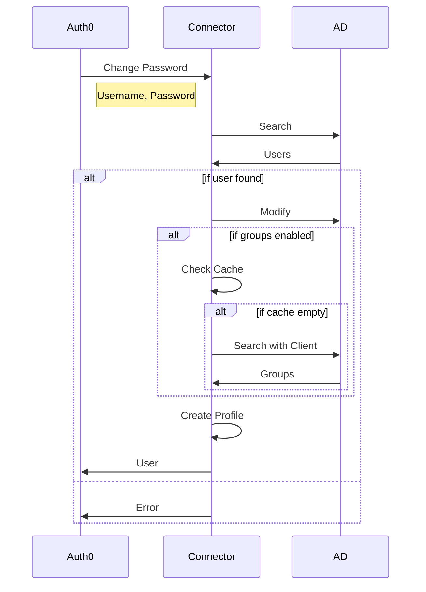
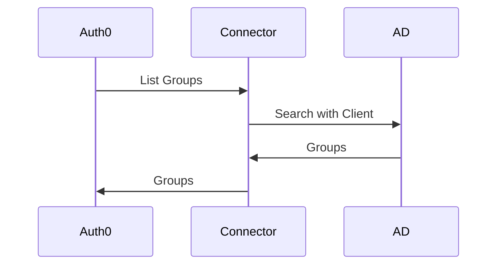

# AD Server Interactions

AD LDAP Connector helps facilitate proxied interactions to an LDAP server. The connector provides a set of
APIs that mirrors the interactions with other connections e.g. Custom Database Connections.

In the diagrams below the following names will be used to indicate the defined participants:

- CIC: The environment of Okta CIC (Auth0) that is being interacted with
- Connector: A running instance of the application defined in this repository
- AD: An active directory implementation that is the backend for the Auth0 connection

All three components act as servers, only the first two act as clients.

## Boot

### Client Instantiation

### Health Check

## HTTP Server

- Source: [endpoints.js](endpoints.js)
- Handled by Password WindowsAuthentication implementation:
  - https://github.com/auth0/passport-windowsauth

### Login

- Endpoint: `/wsfed`

### List Users

- Endpoint: `/users`

## Proxied Interactions

- Source: [ws_validator.js](ws_validator.js)
- Ingress: Websocket

### Authenticate User

- Event: `authenticate_user`

### Search Users

- Event: `search_users`

### Change Password

- Event: `change_password`

### List Groups

- Event: `list_groups`

